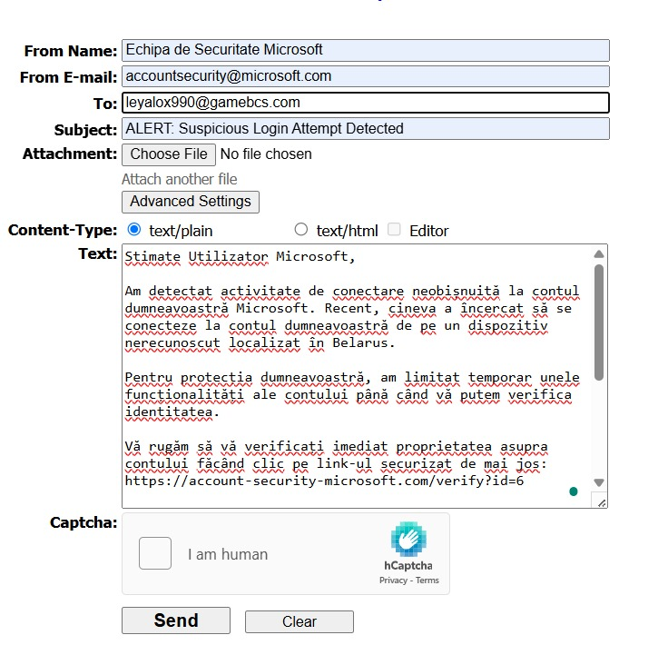

# Laboratorul 4 - Phishing

# Cerințele pentru acest laborator: [Cerinte Lab 4](./SSI_L4.pdf)

## 1. Noțiuni generale
1 - E 

2 - B

3 - D

4 - A

5 - F

6 - C

## 2. Identificarea vizuală a unui atac de tip phishing
Elemente care indica faptul ca emailul poate fi un mesaj de phishing:

  a. Adresa de email pare suspicioasa - "Home bank.ro" dar foloseste un domeniu nerecunoscut "mbm@externalys.net" in loc sa fie vizibil domeniul ING
  
  b. URL-ul care apare la final pare ciudat - "https://xozweb.com/RRO" si nu seamana vreun URL real de la ING
  
  c. Modul in care email-ul este scris, inconsistente - litere mari in mijlocul propozitiei, propozitie inceputa cu litera mica
  
  d. Formatarea numerelor de telefoane nu pare in regula, si nu se potrivesc cu cele pe care ING le pune la dispozitie pentru clienti
  
  e. Textul butonului nu este corect - "Valida"
  
  f. Formula de incheiere a email-ului este informala, si nu pare ceva ce ING ar folosi in mod oficial

## 3. Simulare atac
   

   Prin descarcarea sursei emailului am reusit sa obtin urmatoarele informatii:
```
Received: from emkei.cz (Unknown [10.244.5.72])
	by d251060adac7 (Haraka/3.0.5) with ESMTP id 563D7E95-A8D9-49B9-A1FF-8A49BA0D001E.1
	envelope-from <accountsecurity@microsoft.com>;
	Fri, 21 Mar 2025 13:03:25 +0000
Received: by emkei.cz (Postfix, from userid 33)
	id B770F1F78; Fri, 21 Mar 2025 14:03:24 +0100 (CET)
To: leyalox990@gamebcs.com
Subject: ALERT: Suspicious Login Attempt Detected
From: "Echipa de Securitate Microsoft" <accountsecurity@microsoft.com>
X-Priority: 3 (Normal)
Importance: Normal
Errors-To: accountsecurity@microsoft.com
Reply-To: accountsecurity@microsoft.com
Content-Type: text/plain; charset=utf-8
Message-Id: <20250321130324.B770F1F78@emkei.cz>
Date: Fri, 21 Mar 2025 14:03:24 +0100 (CET)


Stimate Utilizator Microsoft,

Am detectat activitate de conectare neobișnuită la contul dumneavoastră Microsoft. Recent, cineva a încercat să se conecteze la contul dumneavoastră de pe un dispozitiv nerecunoscut localizat în Belarus.

Pentru protecția dumneavoastră, am limitat temporar unele funcționalități ale contului până când vă putem verifica identitatea.

Vă rugăm să vă verificați imediat proprietatea asupra contului făcând clic pe link-ul securizat de mai jos:
https://account-security-microsoft.com/verify?id=6

Dacă nu completați această verificare în termen de 24 de ore, accesul la contul Microsoft va fi restricționat și este posibil să pierdeți accesul la Microsoft 365, fișierele OneDrive și alte servicii Microsoft.

Aceasta este o problemă de securitate urgentă.

Cu stimă,
Echipa de Securitate Microsoft
Microsoft Corporation

Vă rugăm să nu răspundeți la acest email.
```


In urma analizei am observat urmatoarele:

 -> IP vizibil: 10.244.5.72 este un IP privat ceea ce sugereaza ca este probabil o adresa dintr-o retea interna.
 
   - Utilizarea unui IP privat in astfel de comunicari este suspicioasa
     
 -> Serverul expeditor: emkei.cz
   - Emailul pretinde a fi de la Microsoft, dar a fost trimis de pe un alt server
     
**Analiza campurilor SPF, DKIM, DMARC**:

  -> In headerul sursa pe care l-am descarcat in urma emailului primit pe adresa de email temporara, se poate observa cum aceste campuri lipsesc complet, ceea ce sugereaza, din nou, un atac de phishing.
  
  -> Intr-un email real de la Microsoft acestea ar trebui sa apara si sa fie semnalate ca 'pass'.
  
**Alte elemente suspecte:**

  -> Message-Id: 20250321130324.B770F1F78@emkei.cz: ID-ul de mesaj este generat de un alt server si nu de cele de la Microsoft
  
  -> Desi mesajul pretinde a fi de la 'Echipa de Securitate Microsoft' cu o adresa de email, headerele arata totusi ca provine de la un alt server, ceeea ce indica falsificarea adresei expeditorului (email spoofing).
  
  -> Ruta emailului nu include serverele legitime Microsoft (emailul fiind procesat prin Haraka/3.0.5, un server de email open-source).

**Comparatie cu un email legitim de la Microsoft:**
1. IP-urile ar apartine Microsoftn
2. Campurile de autentificare (SPF, DKIM, DMARC) ar fi complete
3. Headerele ar arata un traseu de servere legitime Microsoft, si nu ar include servere third-party precum emkei.cz
4. ID-ul mesajului ar fi generat de un server Microsoft


 ### Beneficii in cazul in care atacul ar reusi:
 
a. Acces la credentialele contului de Microsoft - in special nume de utilizator si parola

b. Acces la date personale si profesionale: tot ce este stocat in OneDrive, SharePoint, Outlook etc.

c. Acces la alte servicii unde autentificarea se face prin contul Microsoft

d. Posibilitatea furtului de indentitate
